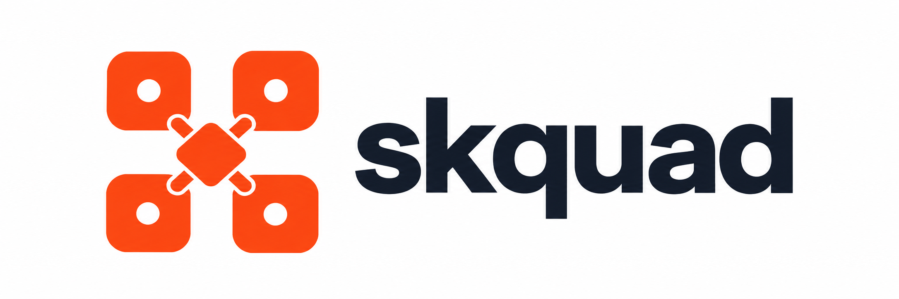

<div align="center">


                                            
<br />
  <div>
    <a href="https://github.com/rossbrigoli/skquad/actions/workflows/ci.yml">
      
    </a>
    <a href="https://github.com/rossbrigoli/skquad/actions/workflows/images.yml">
      
    </a>
    <a href="https://github.com/rossbrigoli/skquad/blob/main/LICENSE">
      
    </a>
    
  </div>
  <br />
</div>

Skquad is a Kubernetes-native control plane for building and operating governed squads of autonomous AI agents. 
It's designed with enterprise use case in mind where full observability, audit logging, identity and access controls are first class citizens.

Skquad models agent collaboration as squads, agents, Kanban tasks, messages,
resource grants, and task-scoped memory. It combines a Go control-plane API, a
Kubernetes operator, a Python agent runtime, and a central LiteLLM gateway so
that agent identity, permissions, model access, and lifecycle remain under
platform control.

> [!IMPORTANT]
> skquad is an early-stage project with a working vertical slice; it is not yet
> production-ready. See [Current status](#current-status) before deploying it.

## How it works

skquad separates management concerns from agentic AI workloads:

- The **control plane** runs the API server, LiteLLM gateway, web
  application, and Kubernetes operator in `skquad-system` namespace.
- The **data plane** runs each squad in its own Kubernetes namespace. Agent
  Deployments wake up for assigned work and scale back to zero after becoming
  idle.

```text
Clients ───────► Control-plane API
                      │
                      └── durable outbox ─► Squad and Agent CRs
                                                   │
                                               Operator
                                                   │
                                      per-squad namespaces and agent pods

Agent runtime ── tasks, messages, context ─────► Control-plane API
              └─ model requests ───────────────► LiteLLM gateway ─► providers
```

The control plane is the source of truth. Kubernetes custom resources are
derived execution state reconciled by the operator; agent runtimes do not
receive direct database access or provider credentials.

Read the [architecture overview](docs/ARCHITECTURE.md) and the
[runtime architecture ADR](docs/adr/0001-agent-runtime.md) for the design in
detail.

## Core concepts

| Concept | Meaning |
| --- | --- |
| **Squad** | A user-owned team of agents with a mission and operating model. Each squad is isolated in its own Kubernetes namespace. |
| **Agent** | A squad member with an independent runtime, identity, credentials, permissions, and bounded task context. |
| **Board and task** | Each squad has a Kanban board. Tasks are the durable unit of work assigned to agents. |
| **Resource registry** | The catalog of LLM providers, skills, tools, APIs, knowledge sources, and project workspaces available to the platform. |
| **Permission** | An explicit grant connecting an agent to a registry resource. |
| **Access grant** | Permission for another user to interact with a squad or one of its agents. |

## Components

| Component | Technology | Responsibility |
| --- | --- | --- |
| [`control-plane/`](control-plane/) | Go | REST API, human and agent authentication, domain state, authorization, audit events, and Kubernetes outbox. |
| [`operator/`](operator/) | Go, controller-runtime | Reconciles `Squad` and `Agent` resources into namespaces, workloads, and scale-to-zero lifecycle. |
| [`agent-runtime/`](agent-runtime/) | Python, FastAPI | Claims tasks, assembles context, loads granted plugins, calls models, drains messages, and reports outcomes. |
| [`llm-gateway/`](llm-gateway/) | LiteLLM | Central model proxy and per-agent virtual-key boundary. |
| [`web/`](web/) | Next.js | User interface with an authenticated shell plus squad, agent, task, registry, grant, admin, identity, and chat workflows. |
| [`embedder/`](embedder/) | llama.cpp (llama-server) | Embedding service for agent-memory RAG: Qwen3-Embedding-0.6B, OpenAI-compatible `/v1/embeddings`, CUDA/Vulkan/CPU runtime variants (see [embedder README](embedder/README.md), [ADR-0013](docs/adr/0013-embedder-runtime-selection.md)). |
| [`charts/skquad/`](charts/skquad/) | Helm | Installs the control plane, CRDs, operator, gateway, embedder, web app, and optional PostgreSQL. |

## Built-in Tools

Skquad ships three first-class platform tools (no external plugins required), available to agents when the platform admin enables them:

- **`exec`** — run terminal commands in the agent's environment.
- **`web_fetch`** — fetch a URL and extract readable content.
- **`web_search`** — web search (Brave/Perplexity backends).
- **`memory_search`** — semantic search over the agent's own stored memories (pgvector cosine ranking; query embedded through the gateway → embedder). See [embedder README §4](embedder/README.md).

Key properties:

- **Admin-only configuration.** Tools are enabled and policy-tuned exclusively by platform admins via the admin UI (backed by `GET/PATCH /api/v1/admin/tools`; every change is audit-logged). Agents read their effective config from `GET /api/v1/agents/me/tools` — never containing secrets.
- **Kill switch.** The operator-level `SKQUAD_AGENT_BUILTIN_TOOLS_ENABLED` flag disables the whole built-in tools feature across the deployment, independent of per-tool config.
- **Search keys are control-plane-only.** Brave/Perplexity API keys live in the control plane and are used server-side; they are never sent to agents.
- All tools default to **disabled** until an admin turns them on.

See [ADR-0012: Built-in Platform Tools](docs/adr/0012-builtin-platform-tools.md) for the full contract.

## Current status

The repository currently implements:

- squad, agent, board, task, access-grant, resource-registry, permission,
  messaging, audit, and metering-read APIs;
- development authentication, OIDC token validation with IdP group →
  `platform_admin` binding (`apiServer.oidc.adminGroups`), a LAN/Tailscale-only
  break-glass admin login, and separate agent-service credentials;
- PostgreSQL persistence with a process-local in-memory option for API
  development and tests;
- durable outbox delivery of Squad and Agent custom-resource changes;
- operator reconciliation, deletion finalizers, workload wake-up, and
  idle scale-down;
- task claiming and completion, task-scoped context, bounded recent memory,
  lease-backed/fenced task execution, durable task-result summaries, inbox
  processing, and permission-filtered runtime plugins;
- LiteLLM gateway deployment and agent-scoped virtual-key provisioning; and
- Helm packaging plus CI validation and versioned container images.

Important gaps remain:

- the web application has initial squad, agent, task, registry, grant, admin,
  identity, and chat workflows, but rich detail views, charts, live updates,
  drag and drop, and guided onboarding are not complete;
- automatic memory embedding generation and durable artifact storage are planned;
- automatic task materialization for `delegate`/`handoff` messages is planned;
  and
- production ingress, TLS, external-database operations, observability, and
  network-policy hardening are not complete.

The detailed source-of-truth requirements are in
[`docs/REQUIREMENTS.md`](docs/REQUIREMENTS.md). The
[`implementation status ledger`](docs/implementation-status.md) reconciles the
design docs with what is implemented, what is in review, and what remains
deferred. Component READMEs describe the implemented slice and their next
steps.

## Development deployment

### Prerequisites

- a Kubernetes cluster and `kubectl` configured for it;
- Helm 3; and
- access to the container images configured in
  [`charts/skquad/values.yaml`](charts/skquad/values.yaml).

Install the default development stack:

```bash
helm upgrade --install skquad charts/skquad \
  --namespace skquad-system \
  --create-namespace

kubectl --namespace skquad-system get pods
kubectl --namespace skquad-system rollout status deployment/skquad-api-server
```

Verify the API from another terminal:

```bash
kubectl --namespace skquad-system port-forward service/skquad-api-server 8080:80
curl --fail http://127.0.0.1:8080/healthz
```

The default installation is suitable only for development. It enables a fixed
development admin identity, deploys an in-cluster PostgreSQL instance with a
development password, creates a development LiteLLM master key, and does not
enable ingress.

The default LiteLLM `model_list` is also empty. Before an agent can execute
model-backed work, configure at least one provider model and supply its
credentials through Kubernetes Secrets. The
[Helm chart guide](charts/skquad/README.md) covers provider configuration,
external secrets, image overrides, and production considerations.

## Local development

The toolchains currently used by CI are Go 1.26.8 (both Go modules declare
`go 1.26.8`; the earlier stdlib CVEs in the go1.26.0 toolchain are fixed as
of go1.26.6), Python 3.11, Node.js 20, and Helm 3.

Run the API without Kubernetes or PostgreSQL:

```bash
cd control-plane
go test ./...
SKQUAD_ADDR=127.0.0.1:8080 go run ./cmd/api
```

This starts the API in development-auth mode with process-local storage; all
data is lost when the process exits. Set `SKQUAD_DATABASE_URL` for PostgreSQL,
or see the [control-plane guide](control-plane/README.md) for OIDC, Kubernetes,
runtime, and gateway configuration.

Run the main repository checks:

```bash
(cd control-plane && go vet ./... && go test ./...)
(cd operator && go vet ./... && go test ./...)
(cd agent-runtime && python -m pip install -e . && python -m unittest discover -s tests)
(cd web && npm ci && npm run build)
helm lint charts/skquad
helm template skquad charts/skquad --namespace skquad-system --include-crds >/dev/null
python3 -m unittest discover -s tests/integration
```

The CI workflow also builds and smoke-tests the LiteLLM gateway container. See
the [CI/CD guide](docs/ci-cd.md) for image names, tags, and publishing behavior,
and the [testing strategy](docs/testing-strategy.md) for the integration smoke
suite and cluster-required checks.

## Documentation

| Area | Documents |
| --- | --- |
| Product scope | [Requirements](docs/REQUIREMENTS.md), [domain model](docs/domain-model.md) |
| System design | [Architecture](docs/ARCHITECTURE.md), [data model](docs/data-model.md), [API design](docs/api-design.md), [implementation status](docs/implementation-status.md), [ADRs](docs/adr/) |
| Agent execution | [Runtime](docs/agent-runtime.md), [task lifecycle](docs/kanban-task-lifecycle.md), [messaging](docs/collaboration-messaging.md), [plugins](docs/plugin-architecture.md) |
| Platform services | [LLM gateway](docs/llm-gateway.md), [resource registry](docs/resource-registry.md), [operator and deployment](docs/deployment-operator.md), [operator runbook](docs/operator-runbook.md), [embedder / memory RAG](embedder/README.md) |
| Operations and security | [Identity and security](docs/identity-security.md), [threat model](docs/security-threat-model.md), [observability and metering](docs/observability-metering.md), [CI/CD](docs/ci-cd.md), [testing strategy](docs/testing-strategy.md) |
| Releases | [Versioning](docs/versioning.md) — `major.minor.build`, CI auto-increment, where the version is displayed |
| User experience | [Web application UX](docs/web-app-ux.md) |

## Security and production use

The security documentation describes the intended architecture as well as the
implemented controls; it should not be read as a certification of the current
release. At minimum, a non-development deployment must use OIDC, externally
managed secrets, a production PostgreSQL service, configured provider
credentials, TLS ingress, restrictive network policy, resource limits, and a
backup and monitoring strategy. Review the
[identity and security design](docs/identity-security.md),
[threat model](docs/security-threat-model.md), and
[chart guidance](charts/skquad/README.md) before exposing the system.

## License

Licensed under the [Apache License 2.0](LICENSE).
