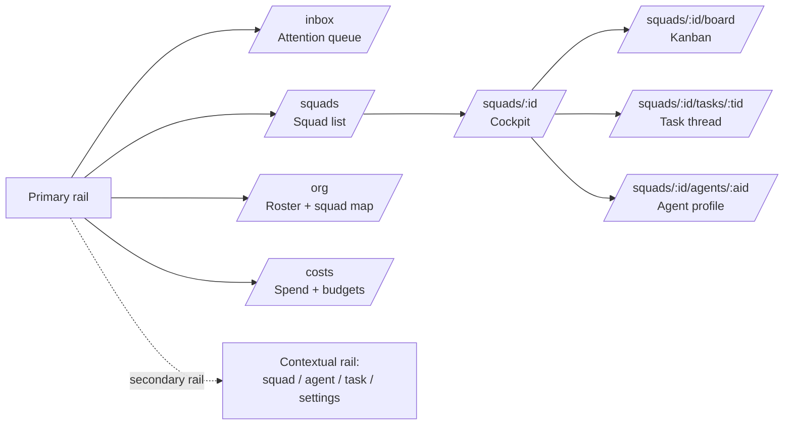

# Skquad UI Redesign Proposal — Inspired by Paperclip

**Date:** 2026-09-22 · **Author:** Sherlock · **Status:** Proposal for review

Reference: [paperclipai/paperclip](https://github.com/paperclipai/paperclip) (cloned and reviewed: README,
`DESIGN.md`, `ui/src/` structure, ~120 pages/components) and our current
`web/src/` (single-page app, ~3,100 LOC of components).

---

## 1. Diagnosis — why the current UI "doesn't work"

The current UI is a **CRUD mirror of our API**, not an operator console.

| # | Problem | Evidence |
|---|---------|----------|
| 1 | **No answer to the operator's core question.** Nothing on screen answers "what is happening, does it need me, what do I do next." The SquadCockpit has metrics but no actionable queue. | `SquadCockpit.tsx` = 4 metric tiles + audit feed. Inbox = raw message list (`InboxSection.tsx`, 48 lines). |
| 2 | **Monolithic SPA, no routes.** One `page.tsx` (~1,000 lines, ~35 `useState` hooks) swaps sections client-side. No deep links, no browser back/forward, no shareable URLs, state resets on reload. | `app/page.tsx` is the only route besides layout. |
| 3 | **Modal-centric.** Every create/edit is a modal over a table. Forms are disconnected from context (creating a task shows a blank form, not its place in the squad's mission). | `Modal.tsx` + `useModalForm` used for nearly every mutation. |
| 4 | **Work-in-progress is invisible.** Agent leases, runs, stalls, and heartbeats — the most interesting things in Skquad — appear only as derived counts. There is no per-run visibility. | `leaseState()` only feeds a metric; no run detail anywhere. |
| 5 | **Status vocabulary is ad hoc.** `busy/idle/error`, `running/stalled/blocked/done`, "owner and platform admins only" — each rendered differently per screen. The operator never learns one vocabulary. | Cockpit vs. board vs. admin tables. |
| 6 | **Cost/audit are dead-end admin tables.** Metering doesn't drive any behavior on screen (no budget warnings, no hard-stop surfacing). | `AdminSection.tsx`, cockpit metering tile. |
| 7 | **No goal spine.** Squads have a mission string, but tasks don't visually roll up to it. Agents and humans can't see the "why." | Mission is an editable text box only. |

## 2. What Paperclip actually does well

Paperclip's design doc (`DESIGN.md` in their repo) is the most transferable artifact. Key ideas:

### 2.1 Product stance
> "The user is an operator scanning state and making decisions. Every screen should
> answer, in order: *what is happening, does it need me, what do I do about it.*
> Density in service of scanning beats whitespace in service of aesthetics — but
> density comes from information, never from chrome."

### 2.2 Patterns worth stealing

1. **Inbox-first / "What Needs Me".** `Inbox`, `WhatNeedsMe`, `DecisionQueuePage`,
   `BlockedInboxView` — a single prioritized attention queue with a nav badge.
   Approvals, blocked tasks, budget incidents, and @-mentions all land in one place,
   each row deep-linking to context.

2. **Two-rail navigation.** A persistent primary sidebar (Inbox, Org, Costs…) plus a
   **contextual secondary sidebar** that swaps with the selected entity
   (`AgentContextualSidebar`, `RoutineContextualSidebar`, `CompanySettingsSidebar`).
   You never lose "where you are" when drilling in.

3. **Entity detail pages, not modals.** `IssueDetail` is a full page: threaded chat
   composer, activity, documents, work products/artifacts, subtask tree, blockers.
   Notable micro-patterns: a paused task replaces the composer with an amber
   "Task is paused — Resume task" takeover; terminal outcomes refresh state silently.

4. **Agents as employees.** `OrgChart`, `AgentDetail` with live run logs, budgets,
   skills, persona; consistent `AgentAvatar`/`AgentCapsule` everywhere. Heartbeat
   activity is visible per agent without opening a terminal.

5. **Goal spine.** `Goals → Projects → Tasks`; every task carries full goal ancestry
   ("goal-aware execution") so the *why* is always one click away.

6. **Systematic status.** One semantic status token set (`--status-task-*`,
   `--status-agent-*`, WCAG-tuned) used identically in badges, rows, charts, and
   logs. "An operator learns the vocabulary once."

7. **Money is a first-class surface.** Budgets per agent/project/company with warning
   thresholds and hard stops rendered everywhere cost appears — `Costs`, budget
   cards, incidents in the inbox.

8. **Design discipline.** Single token source (`index.css`, Tailwind v4 `@theme`);
   no hex/arbitrary values in components; monospace for machine values (IDs, costs,
   token counts, timestamps); one component per job; empty states say what to do
   first; buttons name the action ("Approve hire," not "Submit").

### 2.3 What NOT to copy

- **The company metaphor.** Paperclip is CEO/hiring/org-chart theatre. Skquad already
  has a better-fitting vocabulary: squads, agents, tasks, grants. Steal the
  *patterns*, not the corporate roleplay.
- **Scope.** Multi-company tenancy, plugin marketplace, SSO/GRC, Skill Studio —
  irrelevant to our current stage. Paperclip's UI has ~277 feature components; we
  need ~40.
- **Their stack constraints** (Vite + separate SPA). We keep Next.js; routes give us
  what their router does.

## 3. Target design for Skquad

### 3.1 Information architecture

- **Primary rail (always visible):** Inbox (badge), Squads, Org, Costs. Admin-ish
  sections (Providers, Resources, Grants, Audit) demote into a *Settings* area in
  the contextual rail — they are occasional, not daily.
- **Contextual secondary rail** swaps with selection, exactly like Paperclip:
  selecting a squad shows its tabs (Overview · Board · Agents · Tasks · Budget ·
  Settings); selecting an agent shows its profile nav; on narrow screens it becomes
  an overlay drawer.

### 3.2 The five screens that matter

1. **Inbox (attention queue).** Client-side composition of data we already have:
   stalled tasks, blocked tasks, tasks sitting in review > N hours, budget
   threshold warnings, unread messages, agent error states. Each row: status chip,
   one-line reason, age, deep link. This single screen fixes problem #1.
2. **Squad cockpit (routed).** Mission header (the spine), live-runs strip
   (which agent is on which task right now, with lease age), cost tile that turns
   amber/red against budget, activity feed with actor avatars. Keep what works in
   `SquadCockpit.tsx`; add the live-runs strip and link every tile.
3. **Task detail page.** Thread (chat scoped to the task), run history with
   per-run logs, work products, status timeline, actions: reassign / block /
   pause / resume. This replaces the modal-only workflow and mirrors Paperclip's
   `IssueDetail` at 20% of the scope.
4. **Agent profile page.** Status, current lease, recent runs + transcripts,
   spend vs budget, granted resources (from grants API), model access. Fixes
   problem #4: today you cannot answer "what is agent X doing and what did it
   cost" without admin SQL.
5. **Costs.** Per-squad/agent/provider breakdown, budget policies with
   warn/hard-stop thresholds, cost events in a timeline. Reuses existing metering
   API; needs budget-policy display only.

### 3.3 Design system (Phase 0, applies to everything)

- Adopt a **`DESIGN.md` + token layer** pattern from Paperclip: all color/spacing/
  status/motion values as CSS custom properties in `globals.css`; zero hardcoded
  values in components.
- **One status vocabulary**, mapped from our existing states:
  `running` · `stalled` · `blocked` · `in-review` · `idle` · `error` ·
  `over-budget` · `paused`. Same chip component, same tokens, everywhere.
- **Monospace token** for IDs, costs, token counts, timestamps, lease ages.
- Shared primitives: `StatusChip`, `EntityRow`, `EmptyState` (says what to do
  first), `MetricTile`, `Thread`, `Composer`, `ConfirmDialog`.

### 3.4 API gap check (control-plane impact)

Mostly **client-side composition — no new endpoints needed for Phases 0–2:**

| Need | Today | Gap |
|------|-------|-----|
| Inbox composition | inbox, tasks, agents, metering endpoints exist | None (parallel fetch + client merge) |
| Live runs strip | task leases + agent status exist | None; per-run correlation would improve it |
| Task thread | task-scoped messages exist | None |
| Run transcripts per agent | audit log exists, coarse | Small: run-scoped log correlation (later phase) |
| Budget warn/hard-stop | metering exists, budgets unclear | Small: budget policy fields/endpoints (Phase 3) |

## 4. Phased plan (no big-bang rewrite)

| Phase | Scope | Effort | Fixes |
|-------|-------|--------|-------|
| **0. Design tokens + status vocabulary** | Token layer in `globals.css`, `StatusChip` + shared primitives, retrofit existing screens | S (~1–2 days) | Problems #5, visual chaos everywhere |
| **1. Routing restructure** | Next.js routes per §3.1; decompose `page.tsx` into route-level components + `SquadContext`; contextual rail; deep links | M (~3–4 days) | Problems #2, #3 |
| **2. Attention-first Inbox + Task thread page** | Merged attention queue with badge; task detail page with thread/runs/actions | M (~3–4 days) | Problems #1, #3 |
| **3. Agent profiles + Org view + Costs w/ budgets** | Agent detail pages, squad roster/map, budget thresholds (needs small API work) | M–L | Problems #4, #6 |
| **4. Polish** | Motion tokens, mobile drawer behavior, empty states, copy pass (buttons name actions) | S | #7 polish |

Each phase keeps the existing test harness green (lint, tsc, vitest, the headless-Chrome
request-body suite) and ships independently.

## 5. Recommendation

Adopt Paperclip's **operator stance and navigation model**, not its company metaphor
or scope. Start with Phase 0 + 1 together: the token layer makes the redesign
coherent, and routing is the load-bearing change everything else hangs on. The
biggest single win is Phase 2's attention queue — it converts Skquad from "a web
form in front of an API" into a control plane you can glance at and trust.

**Validate before building:** (1) confirm the deployed API returns enough
lease/run detail for the live-runs strip; (2) decide whether budgets are a Phase 3
prerequisite or can be deferred; (3) check mobile usage — if Ross drives from a
phone, Phase 4's drawer behavior should be pulled into Phase 1.
