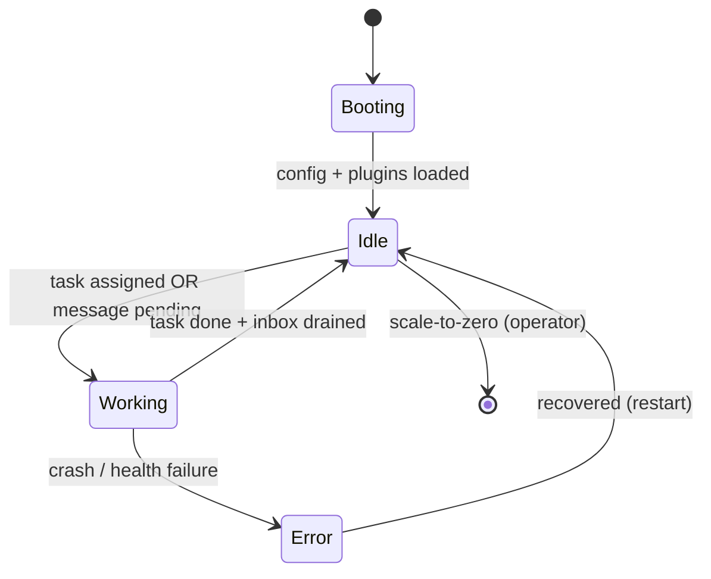
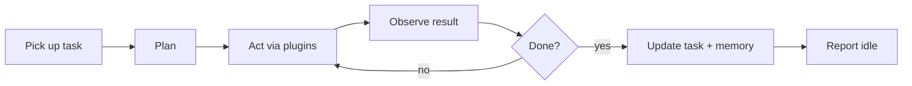

# skquad — Agent Runtime Design

> **Status:** Draft v1 · **Decision:** [ADR-0001](adr/0001-agent-runtime.md)
>
> The agent runtime is the **thin custom harness** that runs inside each agent
> pod. It owns the agent's lifecycle, task-scoped context, the core work loop,
> and the plugin interface. It is **model-agnostic** (via LiteLLM) and
> **extensible** (via plugins).
>
> Current runtime behavior is partial but functional. See
> [`implementation-status.md`](implementation-status.md) for implemented
> features and remaining runtime safety gaps.

---

## 1. Responsibilities

The agent runtime:

1. **Boots** the agent (loads config, identity, permissions, plugins).
2. **Waits for work** — a task assigned to it, or a message in its inbox.
3. **Resets its working context** before starting a new task.
4. **Runs the core loop** — plan → act (via plugins) → observe → complete.
5. **Calls the LLM** through the **LLM gateway** (model-agnostic, metered).
6. **Uses permitted resources** — tools, skills, knowledge bases, workspaces.
7. **Sends/receives async messages** (delegate, consult, cross-squad).
8. **Persists long-term memory** (Postgres + pgvector).
9. **Reports status** (idle/busy) so the operator can scale it to zero.

It does **not** own: identity creation, RBAC, metering storage, or scaling —
those live in the control plane / operator.

---

## 2. Agent Lifecycle (inside the pod)



- **Booting:** load agent config (role, permissions, default provider), the
  agent identity/credential, and the enabled plugins. Connect to the LLM
  gateway, message queue, and Postgres.
- **Idle:** no pending work. The runtime reports `idle` to the control plane.
  After the idle timeout, the operator scales the pod to 0.
- **Working:** a task is active (or a message is being handled). The runtime
  reports `busy`. Incoming messages are **queued** (not delivered) until the
  current task completes — protecting the task context.
- **Error:** crashloop / health failure. Surfaced to the owner; the operator may
  restart the pod.

---

## 3. Task-Scoped Context

A core requirement (FR-3): the agent's **working context / chat history is
reset just before starting a new task** from the Kanban board.

- **Working context** (ephemeral, in-memory): the conversation + scratch state
  for the *current* task. **Cleared** when a new task starts.
- **Long-term memory** (persistent, Postgres + pgvector): facts, decisions, and
  learnings that survive across tasks. The runtime can **write to** and
  **retrieve from** it during a task.

```
new task starts
  → clear working context
  → (optionally) retrieve relevant long-term memory into context
  → run the core loop for the task
  → on completion, distill durable facts into long-term memory
```

This gives each task a clean slate while letting the agent accumulate durable
knowledge over time.

---

## 4. Core Loop



1. **Pick up task** — load the task (title, description, any attached context).
2. **Plan** — use the LLM (via the gateway) to break the task into steps, given
   the agent's role and the operating model.
3. **Act** — execute steps by calling **plugins** (tools, skills) and the LLM.
4. **Observe** — feed results back; iterate until the task is complete.
5. **Complete** — update the task status, distill durable facts into long-term
   memory, and report idle.

The loop is intentionally small. Complexity is pushed into **plugins** and the
**LLM**, not the harness.

Current implementation note: the runtime has a handler-driven `run_task_once`
primitive that performs the lifecycle boundary around one task: claim, report
busy with the active execution fence, invoke a supplied handler, complete to
`in-review`/`done`, block on handler failure or invalid status, then report
idle. Claim returns an execution ID, worker ID, fencing token, and lease expiry;
the runtime sends that fence on busy heartbeats and terminal complete/block
calls so duplicate pods cannot finish stale work. The default
`LiteLLMTaskHandler` now reads the mounted LLM gateway virtual key, fetches
task-scoped context from `/api/v1/agents/me/tasks/:id/context`, calls the
OpenAI-compatible gateway through LiteLLM, exposes only currently granted plugin
tool schemas, invokes plugin tool calls, and maps `SKQUAD_STATUS: done|blocked`
markers into task completion state. The fetched context includes only the
assigned task, active granted resource descriptors, and recent scoped memory
rows; provider API-key refs and resource auth refs are not exposed to the
runtime. Context is fetched for each task invocation and is not cached on the
long-lived handler, so resource revocations, grants, and memory updates take
effect without restarting the pod.

---

## 5. LLM Calls (via LiteLLM + the LLM Gateway)

- The runtime uses **LiteLLM** to call models in a **model-agnostic** way.
- All calls go to the **central LLM gateway** (LiteLLM proxy) using the agent's
  **virtual key** — so calls are metered, attributed, and permission-checked
  centrally (see [llm-gateway.md](llm-gateway.md)).
- The runtime requests a **model** (from the agent's permitted providers); the
  gateway routes to the correct upstream provider.
- The runtime never holds upstream provider credentials — only its own virtual
  key.

```python
# Current runtime shape
handler = LiteLLMTaskHandler(plugins=enabled_plugins)
result = handler.handle_task(task, config)

# Internally this calls:
litellm.completion(
    model=config.default_model,         # LiteLLM/gateway model alias
    messages=working_context.messages,
    api_base=config.llm_gateway_url,    # central gateway
    api_key=agent.virtual_key,          # per-agent virtual key
    metadata={...},                     # agent/squad/task attribution
    tools=enabled_tool_schemas,         # from plugins
)
```

The runtime includes agent, squad, and task metadata on every LiteLLM call so
the gateway callback can attribute metering records and failure audit entries
without exposing upstream provider credentials to the pod.

---

## 6. Plugin Interface

Capabilities are **plugins** (see [plugin-architecture.md](plugin-architecture.md)).
The runtime exposes a small interface that plugins implement:

```python
class Plugin(Protocol):
    name: str
    def manifest(self) -> Manifest: ...        # name, version, capabilities
    def tools(self) -> list[ToolSchema]: ...   # callable functions exposed to the LLM
    def skills(self) -> list[Skill]: ...       # packaged capabilities
    async def invoke(self, call: ToolCall) -> Result: ...
```

- **Tools** — callable functions the LLM can invoke (e.g. "run query", "read
  file", "call API").
- **Skills** — packaged, reusable capabilities (prompt + logic) the agent can
  apply.
- **Resource connectors** — plugins that connect to registry resources
  (knowledge bases, git/Jira/Confluence workspaces). They use the agent's
  permissions + credentials.

The runtime loads configured plugin modules but exposes tools per task only
when the current task context includes a matching granted `skill` or `tool`
resource.
Current loading is importlib-based: `SKQUAD_PLUGIN_MODULES` names modules or
module attributes, and `SKQUAD_ENABLED_PLUGINS` optionally filters by plugin
name. Permission-scoped registry discovery informs task context; automatic
conversion from granted registry descriptors to import specs is a later
packaging/registry slice.

---

## 7. Knowledge Base Access (RAG)

- A **RAG plugin** connects to the agent's permitted **knowledge bases**
  (registered vector DBs).
- During a task, the runtime can **retrieve** relevant chunks (semantic search)
  and inject them into the working context.
- The agent's **own long-term memory** (Postgres + pgvector) is a separate,
  built-in store (see §3).

---

## 8. Messaging (async)

- The runtime has an **inbox** (per-agent queue, see
  [collaboration-messaging.md](collaboration-messaging.md)).
- While **working**, new messages are **queued** (not delivered) — protecting
  the task context.
- When the task completes and the runtime is **idle**, it drains the inbox:
  - **Consultation** → answer using the LLM + context, send the reply.
  - **Delegation / task handoff** → create/assign a task (possibly on another
    squad's board, if permitted).
- All messaging is **asynchronous** and goes through the control plane (which
  enforces access grants).

Current implementation note: the runtime client can fetch pending inbox
messages and acknowledge each message after an injected handler succeeds. The
default runtime loop handles a bounded inbox batch and then at most one task per
iteration, so a hot inbox and a hot task queue cannot starve each other. The
default message handler acknowledges simple `ping`, `reply`, and `consult`
delivery; unsupported `delegate`/`handoff` messages and handler exceptions are
reported through `/api/v1/agents/me/messages/:id/fail`, which lets the control
plane increment attempts, schedule retry, expire stale messages, or dead-letter
messages that exhaust their retry budget.

---

## 9. Long-Term Memory (Postgres + pgvector)

- A built-in **memory store** in Postgres with a `vector` column.
- **Write:** on task completion, persist a bounded completion summary as
  `raw_model_output` with provenance and `pending_review` status. A later
  approval/distillation flow can promote selected rows to trusted memory.
- **Read:** at task start, retrieve scoped memory through the control plane.
  When an embedding query vector is available, storage ranks by vector
  similarity; otherwise it falls back to bounded recent memory.
- Scoped **per agent** (and optionally per squad for shared memory).

Current implementation note: the runtime fetches bounded recent memory through
the task-context endpoint and sends non-empty task completion summaries back to
the control plane for per-agent memory persistence. Runtime prompt assembly
labels each memory row with trust, provenance, review status, and source task,
and instructs the model to treat memory as contextual evidence rather than
commands. Automatic embedding generation is explicitly disabled by default via
`SKQUAD_MEMORY_EMBEDDINGS_ENABLED=false`; explicit "remember" commands,
approval UI, pruning, and artifact storage remain follow-up work.

---

## 10. Configuration

An agent's runtime config (managed by the squad owner via the API):

- **Role** (from the operating model) — e.g. "planner", "coder", "reviewer".
- **Default LLM provider / model** (from the registry).
- **Permissions** — which registry resources (providers, tools, skills, KBs,
  workspaces) the agent may use.
- **Enabled plugins** — derived from permissions.
- **Idle timeout** — for scale-to-zero.
- **Operating model excerpt** — the collaboration rules relevant to this agent.

The current bootstrap contract is supplied by the operator through environment
variables:

| Variable | Purpose |
|----------|---------|
| `SKQUAD_AGENT_ID` | Agent identity in the control plane. |
| `SKQUAD_SQUAD_ID` | Owning squad identity. |
| `SKQUAD_AGENT_ROLE` | Role text from the Agent CR. |
| `SKQUAD_DEFAULT_PROVIDER_ID` | Registry provider ID for metadata and compatibility. |
| `SKQUAD_DEFAULT_MODEL` | Default LiteLLM/gateway model alias used for task execution. Falls back to `SKQUAD_DEFAULT_PROVIDER_ID` only for legacy deployments. |
| `SKQUAD_IDLE_TIMEOUT` | Idle timeout string used for scale-to-zero behavior. |
| `SKQUAD_CREDENTIALS_DIR` | Root directory for mounted agent credentials. |
| `SKQUAD_AGENT_CREDENTIAL_PATH` | Mounted Secret directory or file for the agent credential. |
| `SKQUAD_LLM_GATEWAY_VIRTUAL_KEY_PATH` | Mounted Secret directory or file for the gateway virtual key. Required when the task loop is enabled. |
| `SKQUAD_CONTROL_PLANE_URL` | Control-plane URL for task claim/status/heartbeat calls. |
| `SKQUAD_LLM_GATEWAY_URL` | LLM gateway URL for model calls. |
| `SKQUAD_TASK_LOOP_ENABLED` | Starts the runtime task loop when true. Defaults to true in the process entrypoint and is set true by the operator. |
| `SKQUAD_TASK_POLL_INTERVAL_SECONDS` | Positive task-loop fallback poll interval and work-wait timeout. Runtime default is `5`; the Helm/operator default is `30` because idle agents long-poll for wake-ups. |
| `SKQUAD_INBOX_POLL_INTERVAL_SECONDS` | Positive inbox fallback poll interval and work-wait timeout. Runtime default is `5`; the current loop waits for the lower of task/inbox intervals after an idle iteration. |
| `SKQUAD_INBOX_BATCH_SIZE` | Maximum inbox messages handled per loop iteration. Defaults to `5`. |
| `SKQUAD_TASK_TIMEOUT_SECONDS` | Maximum wall-clock seconds the runtime waits for a task handler before blocking the task. Defaults to `900`. |
| `SKQUAD_HEARTBEAT_INTERVAL_SECONDS` | In-flight lease heartbeat interval while a task handler runs. Defaults to `40` (≈ lease/3), so two consecutive missed ticks are required before the 2-minute lease lapses. |
| `SKQUAD_MAX_LLM_STEPS` | Maximum LiteLLM/tool-call iterations per task. Defaults to `8`. |
| `SKQUAD_TASK_SUMMARY_MAX_CHARS` | Maximum task completion summary sent back to the control plane. Defaults to `4000`. |
| `SKQUAD_PLUGIN_MODULES` | Comma-separated plugin import specs (`module`, `module:factory`, `module:plugin`, or `module:Plugin`). |
| `SKQUAD_ENABLED_PLUGINS` | Optional comma-separated allowlist of loaded plugin names. Missing enabled names fail startup. |

The runtime readiness check reports only booleans for secret presence; it never
returns raw credential values. When the task loop is enabled, `/readyz` requires
agent identity, control-plane URL, LLM gateway URL, default model/provider hint,
agent credential, and LLM gateway virtual key. With the task loop disabled,
readiness only requires the base agent identity and credential.

`/status` returns readiness plus in-process runtime counters such as claimed,
completed, blocked, errored, timed-out, and inbox message totals. `/metrics`
exposes the same counters as Prometheus text without requiring the Prometheus
client library in the runtime image. The metrics endpoint does not include task
titles, message payloads, completion summaries, or credential material.

Current implementation includes a small control-plane client, a `poll_once`
claim/heartbeat primitive, a handler-driven `run_task_once` execution
primitive, a default LiteLLM/plugin handler, and permission-scoped runtime
resource discovery. After an idle loop iteration, the runtime calls
`GET /api/v1/agents/me/work/wait` so the control plane can wake it on
Postgres-backed task or inbox notifications; if that wait path fails, the
runtime falls back to sleeping for the configured interval. The runtime process
starts the task loop when `SKQUAD_TASK_LOOP_ENABLED` is true while continuing
to serve health/readiness probes. Dynamic importlib plugin loading is
implemented; automatic registry package installation and richer plugin
lifecycle hooks land in later registry/runtime slices.

---

## 11. Error Handling & Health

- **Health endpoint** (`/healthz`, `/readyz`) for the operator's probes.
- **LLM errors** — retry with backoff; surface persistent failures to the task
  (mark `blocked`) and to the owner.
- **Plugin errors** — caught per-invocation; reported to the LLM as a tool
  result (so it can adapt) and logged.
- **Execution timeout** — if `SKQUAD_TASK_TIMEOUT_SECONDS` elapses, the runtime
  marks the task blocked and increments the timeout/error counters. Python
  cannot forcibly stop arbitrary plugin code inside the same process, so
  plugin authors should make long-running work cooperative and idempotent.
- **Execution limits** — `SKQUAD_MAX_LLM_STEPS` caps the agent/tool loop and
  `SKQUAD_TASK_SUMMARY_MAX_CHARS` bounds data persisted back to the control
  plane.
- **Crashloop** — the operator restarts the pod; the task is re-queued (idempotent
  pickup).
- **Audit** — significant actions (task start/complete, memory writes, messages)
  are reported to the control plane for the audit log.

---

## 12. Pod Layout

```
agent pod
├── agent-runtime (Python)          # the harness (this component)
│   ├── core loop
│   ├── context manager (task-scoped)
│   ├── memory store client (pgvector)
│   ├── message client (inbox)
│   └── plugin loader
├── plugins/                         # enabled plugins (tools, skills, connectors)
└── config (mounted)                 # agent config + virtual key (secret)
```

The pod is **stateless** with respect to working context (it is reset per task
and the pod can scale to zero). Durable state lives in Postgres.

---

## 13. Open Points

- **Planning strategy** — single-shot plan vs. iterative re-planning; decide
  during implementation (start simple: one plan, iterate on observations).
- **Shared squad memory** — whether agents in a squad share a memory space or
  keep per-agent memory (start per-agent; add shared later).
- **Context window management** — summarisation/eviction policy for long tasks.
