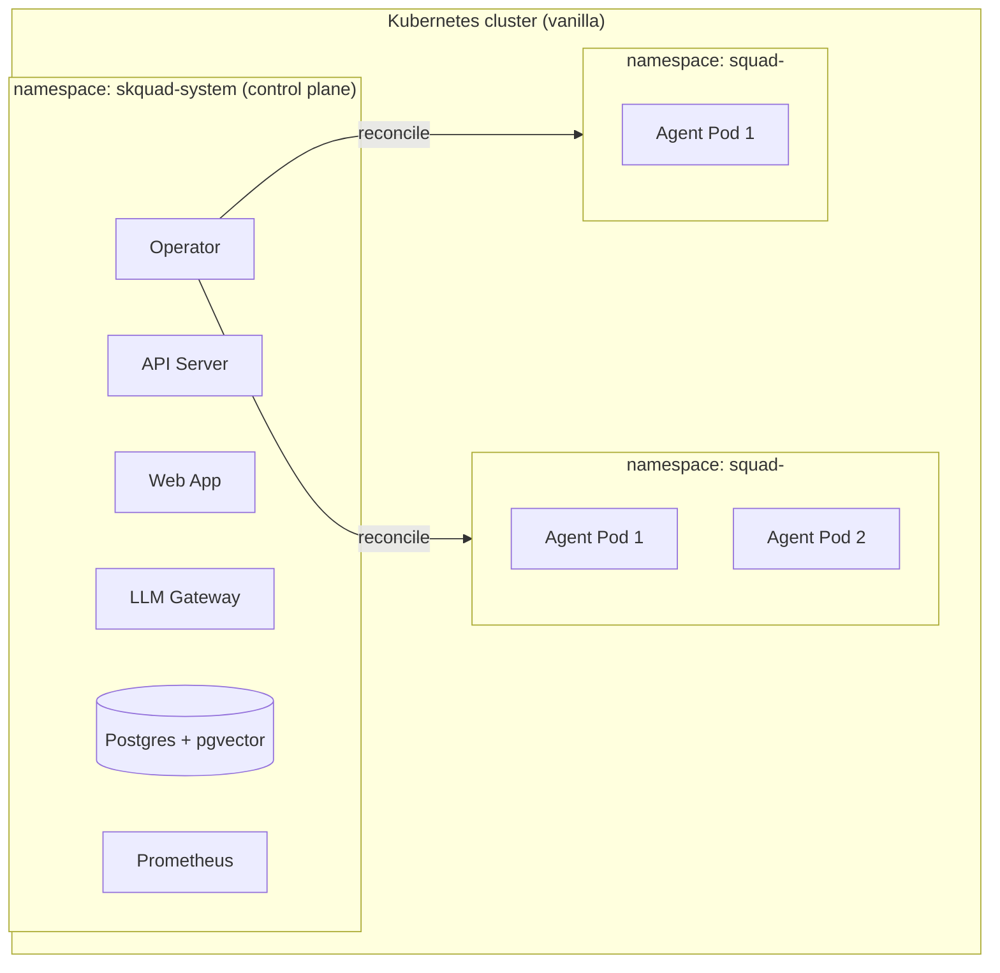

# skquad — Deployment & Operator Design

> **Status:** Draft v1 · **Decision:** [ADR-0006](adr/0006-deployment.md), [ADR-0003](adr/0003-scale-to-zero.md)
>
> skquad runs on **vanilla Kubernetes** (no OLM). A **custom operator** (Go,
> controller-runtime / kubebuilder) manages **squad** and **agent** lifecycle,
> **namespace isolation**, and **scale-to-zero**. Everything is packaged and
> deployed with **Helm**.
>
> For practical install, upgrade, troubleshooting, and cleanup commands, see
> the [operator install and operations runbook](operator-runbook.md).

---

## 1. Deployment Topology



- **Control plane** — one namespace (`skquad-system`) holding the API server,
  web app, LLM gateway, operator, Postgres, and (optionally) Prometheus.
- **Data plane** — **one namespace per squad** (`squad-<id>`), each holding that
  squad's agent pods + secrets + network policies.

---

## 2. Custom Resources (CRDs)

The operator defines two CRDs:

### 2.1 `Squad`
```yaml
apiVersion: skquad.io/v1
kind: Squad
metadata:
  name: squad-<id>
  namespace: skquad-system
spec:
  squadId: <uuid>
  ownerRef: <user id>
  mission: "..."
  operatingModel: { ... }
  status: active | archived | deleted
```
- Reconciles the **squad namespace** + base resources.

### 2.2 `Agent`
```yaml
apiVersion: skquad.io/v1
kind: Agent
metadata:
  name: agent-<id>
  namespace: skquad-system
spec:
  agentId: <uuid>
  squadId: <uuid>
  role: "coder"
  defaultProviderId: <provider-uuid>
  defaultModel: "openai/gpt-4o-mini"
  image: skquad/agent-runtime:<tag>
  credentialSecret: agent-<id>-credential
  virtualKeySecret: agent-<id>-virtual-key
  permissions: { ... }      # registry resource refs
  idleTimeout: 300s
  desiredActive: true|false  # set by control plane when work is pending
status:
  idleSince: <timestamp>     # set by operator while waiting to scale down
```
- Reconciles the agent **Deployment** and **replica count** (scale-to-zero).
  Agent credential and LLM gateway virtual-key Secrets are generated by the
  control plane and mounted by the operator when their Secret names are present
  in the Agent CR.

> The **control plane (API server)** is the source of truth for domain state and
> **creates/updates** these CRs. The **operator** reconciles the cluster to
> match them.

---

## 3. Squad Reconciliation

When the operator sees a `Squad` CR:

1. **Create the squad namespace** (`squad-<id>`) if absent.
2. **Create base resources** in the namespace:
   - **NetworkPolicy** — isolate the namespace (default-deny; allow only the
     paths agents need: LLM gateway, message queue/Postgres, permitted
     resources).
     The reconciler creates default deny, DNS egress to `kube-system`,
     and platform egress back to API server / LLM gateway pods in the
     control-plane namespace by pod selector. Granted external resources
     are rendered from `spec.operatingModel.egress.allow[]` into the
     `allow-granted-egress` policy (see §9).
   - **ResourceQuota** — cap CPU/memory per squad (configurable).
   - **ServiceAccount** — for the squad's agents.
   - **Secret writer RBAC** — a namespace-local Role/RoleBinding allows the
     control-plane API server ServiceAccount to apply/delete generated agent
     credential and virtual-key Secrets only in this squad namespace.
3. **Status transitions:**
   - `active` → ensure namespace + resources exist.
   - `archived` → scale all agents to 0; keep namespace (read-only).
   - `deleted` → delete the namespace (cascades to agents, secrets, policies).
     Audit rows are retained in Postgres.
4. **Deletion cleanup:** the operator adds a `skquad.io/squad-cleanup`
   finalizer and explicitly deletes managed base resources plus the managed
   namespace before releasing the CR. This is required because a namespaced CR
   in `skquad-system` cannot own a cluster-scoped Namespace through Kubernetes
   garbage collection.

Current consistency note: operator finalizers prevent orphaned cross-namespace
resources during CR deletion. Squad and Agent create/update/delete/status
mutations now enqueue durable Kubernetes outbox events in the same store
mutation that changes Postgres state; a control-plane worker leases those events
and applies the CR writes asynchronously. HTTP mutation responses therefore
mean "the domain mutation and Kubernetes intent were accepted", not "the
operator has already converged". Generated credential and virtual-key Secret
writes are still synchronous because raw token material is not stored in
Postgres.

---

## 4. Agent Reconciliation

When the operator sees an `Agent` CR:

1. **Create the agent Deployment** in the squad namespace:
   - Image: the agent runtime.
   - **Replicas:** `1` if `desiredActive`; otherwise keep an existing replica
     warm until `idleTimeout` has elapsed, then scale to `0`.
   - **Secrets:** mount the agent's credential + LLM gateway virtual key when
     the Agent CR includes Kubernetes Secret names.
   - **Env:** agent config (role, registry provider ID, default model alias,
     endpoints, `SKQUAD_TASK_LOOP_ENABLED=true`, fallback task/inbox poll
     intervals, inbox batch size, task timeout, LLM step cap, and completion
     summary cap). Idle runtimes long-poll the control plane for task/inbox
     wake-ups before using the fallback interval.
   - **Probes:** `/healthz`, `/readyz`.
   - **Resources:** requests/limits (configurable).
2. **React to the control plane's desired activity signal.**
3. **Scale-to-zero logic** (ADR-0003):
   - **Scale up (0 → 1):** when the control plane sets `desiredActive: true`
     (a task is assigned, or a pending inbox message is queued for the agent).
   - **Scale down (1 → 0):** when the agent reports **idle** (task complete,
     inbox drained) **and** the operator-observed **idle timeout** elapses with
     no new work.
4. **Error handling:** crashloop / probe failure → restart; surface to the owner;
   the task is re-queued (idempotent pickup).
5. **Deletion cleanup:** the operator adds a `skquad.io/agent-cleanup`
   finalizer and explicitly deletes the agent Deployment in the squad namespace
   before releasing the Agent CR. This avoids relying on invalid cross-namespace
   owner references.

---

## 5. Scale-to-Zero (detail)

```
Control plane records pending work for agent X
  → sets Agent.spec.desiredActive = true
Operator reconciles
  → Deployment replicas 0 → 1
Agent pod starts → picks up work → reports busy
  ...
Agent finishes → reports idle → inbox drained
  → control plane sets Agent.spec.desiredActive = false
  → idle timeout elapses (no new work)
Operator reconciles
  → Deployment replicas 1 → 0
```

- The **control plane** is the source of truth for "pending work" (tasks +
  messages). The **operator** only reacts to `desiredActive` + idle signals.
- **Idle timeout** is configurable (per agent or platform default). The operator
  records `status.idleSince` when an inactive Agent still has a running
  Deployment and requeues after the remaining timeout.
- **Metrics:** scale-up/down latency, time-at-zero, wake count (for cost/latency
  tuning).

---

## 6. Helm Chart Layout

```
charts/skquad/
├── Chart.yaml
├── values.yaml
├── crds/                        # Squad, Agent
│   ├── skquad.io_squads.yaml
│   └── skquad.io_agents.yaml
└── templates/
    ├── namespace.yaml              # skquad-system
    ├── api-server-deployment.yaml
    ├── api-server-rbac.yaml
    ├── api-server-service.yaml
    ├── api-server-serviceaccount.yaml
    ├── llm-gateway-configmap.yaml
    ├── llm-gateway-deployment.yaml
    ├── llm-gateway-service.yaml
    ├── operator-deployment.yaml
    ├── operator-rbac.yaml           # ClusterRole/Binding (needs cross-ns)
    ├── operator-serviceaccount.yaml
    ├── llm-gateway-secret.yaml      # LiteLLM master key (dev or external ref)
    ├── postgres-secret.yaml
    ├── postgres-service.yaml
    ├── postgres-statefulset.yaml
    ├── web-deployment.yaml
    ├── web-service.yaml
    ├── ingress.yaml                 # optional public route
    └── prometheus/                   # optional (observability feature)
        └── ...
```

- **One chart** installs the whole control plane + operator.
- **Squad/agent resources** are created via the **API** (not by hand) — the API
  commits domain state plus Kubernetes outbox intents, then the outbox worker
  writes CRs for the operator to reconcile.
- **Values** configure images, replicas, resources, Postgres, idle timeout,
  runtime task/inbox polling defaults, LLM gateway bootstrap config, ingress,
  observability toggle, etc.
- **Secrets** default to chart-managed dev values, but production installs can
  point Postgres, the API database URL, and the LiteLLM master key at
  pre-created Kubernetes Secrets.

---

## 7. Lab GitOps Deployment

The lab cluster deploys Skquad through the `k3s-cluster` GitOps repo:

- Application: `/home/ross/projects/k3s-cluster/apps/app-skquad.yaml`
- Source repo: `https://github.com/rossbrigoli/skquad`
- Source path: `charts/skquad`
- Destination namespace: `skquad-system`
- Image tags: `latest` GHCR images from the Skquad Images workflow
- Ingress: disabled while development authentication remains the chart default

This gives the project a deployable lab target without exposing a dev-auth API
over `*.lab`. Immutable image promotion remains a CI/CD follow-up.

---

## 8. Control Plane Deployment

| Component | Workload | Notes |
|-----------|----------|-------|
| **API Server** | Deployment (≥2) | Stateless; talks to Postgres; leases/writes Kubernetes outbox events. |
| **Web App** | Deployment (≥1) | Serves the SPA; can be same as API server or separate. |
| **LLM Gateway** | Deployment (≥2) | Stateless LiteLLM proxy; authenticates virtual keys; uses Postgres for key/spend state and provider APIs through configured model entries. |
| **Operator** | Deployment (1, leader-elected) | Needs cluster-wide RBAC for managed namespaces and cross-namespace resources. |
| **Postgres** | StatefulSet (or managed) | + pgvector; the primary store. |
| **Prometheus** | Deployment (optional) | Scrapes metrics when observability is enabled. |

- The **operator** needs a **ClusterRole** (it creates namespaces, deployments,
  network policies, and per-squad RBAC across the cluster). The ClusterRole is
  least-privilege scoped: it holds **no Secret access at all** (the operator never
  reads or writes Secret contents — the API server writes agent credentials via
  namespace-local Roles), and **no list/watch** on the fixed-name resources it
  manages (`skquad-agent` SA, `skquad-api-agent-secret-writer` Role/RoleBinding,
  `default-deny` / `allow-dns-egress` / `allow-skquad-platform-egress` /
  `allow-granted-egress` NetworkPolicies, `skquad-squad-quota`, the
  `skquad-operator.skquad.io` leader lease) — those reads go direct to the API
  (cache bypass in `cmd/manager/main.go`) and their get/update/patch/delete are
  `resourceNames`-constrained. `create` for those types remains type-scoped
  because Kubernetes RBAC cannot scope `create` by `resourceNames`
  ([reference](https://kubernetes.io/docs/reference/access-authn-authz/rbac/));
  a ValidatingAdmissionPolicy enforcing the fixed names is the future hardening
  step. `namespaces` and agent `deployments` remain name-unbounded because their
  names are dynamic.
  The API server's generated Secret write/delete authority is granted by
  namespace-local RoleBindings that the operator creates in reconciled squad
  namespaces.

---

## 9. Network Policies & Isolation

- **Squad namespaces** are **default-deny**; egress allowed only to:
  - **DNS** (`kube-system`, UDP/TCP 53).
  - The **API server** and **LLM gateway** pods in the control-plane namespace
    (named port `http`).
  - **Permitted resource endpoints** (git hosts, KBs) — as granted, via the
    `allow-granted-egress` policy rendered from the squad's
    `spec.operatingModel.egress.allow[]`:

    ```json
    {"egress": {"allow": [
      {"cidr": "140.82.112.0/20", "ports": [443], "description": "github.com"}
    ]}}
    ```

    Semantics: **fail-closed** — invalid CIDRs/ports or malformed JSON abort
    reconciliation without widening any policy; an empty/absent allowlist
    removes `allow-granted-egress` so only platform defaults remain.
    Caveat: NetworkPolicy matches **CIDRs only**, not hostnames. Git providers
    must be granted via their published address ranges; a brokered egress proxy
    (gateway-mediated git access) is the upgrade path if CIDR churn becomes a
    problem.
- Agent pods run with `automountServiceAccountToken: false` (the runtime never
  calls the Kubernetes API; credentials arrive as projected Secret volumes) and
  a hardened container securityContext (`runAsNonRoot`, no privilege
  escalation, all capabilities dropped, `RuntimeDefault` seccomp). The shared
  `skquad-agent` ServiceAccount carries **no RBAC bindings**, so a compromised
  agent pod cannot read any Secret — including its own or siblings' — through
  the API; only the volume-projected files it was given are reachable.
- **No direct pod-to-pod** between squads — cross-squad interaction goes through
  the **control plane / message queue** (which enforces access grants).
- The **control plane** is reachable by squad agents (for API + gateway +
  queue) but squad namespaces cannot reach each other.

---

## 10. Installation & Upgrades

- **Install:** `helm install skquad charts/skquad -n skquad-system --create-namespace`
  (CRDs installed first).
- **Configure:** set values (Postgres, OIDC, LLM providers, idle timeout,
  ingress, observability). Use existing Secrets for production database
  credentials instead of committing credentials into values.
- **Upgrade:** `helm upgrade` — the operator + control plane roll out; CRDs are
  versioned for backward compatibility.
- **Uninstall:** `helm uninstall` — removes the control plane; squad namespaces
  are removed via the operator (or manually).

---

## 11. Observability (deployment-level)

- **Prometheus** (optional, enabled via values) scrapes:
  - Control-plane metrics (API, gateway).
  - Operator metrics (reconcile rate, scale-up/down latency).
  - Agent metrics (when pods are up).
- **Logging:** structured logs to stdout (collected by the cluster's logging
  stack).
- **Alerts:** on operator errors, gateway error rate, Postgres health.

---

## 12. Open Points

- **Postgres** — StatefulSet vs. managed (RDS/Cloud SQL) vs. external; confirm
  the default for v1 (managed recommended for production).
- **Multi-cluster** — out of scope for v1 (single cluster).
- **Resource quotas** — default per-squad quotas (tune during implementation).
- **Image pull secrets** — for private agent-runtime images (later).
