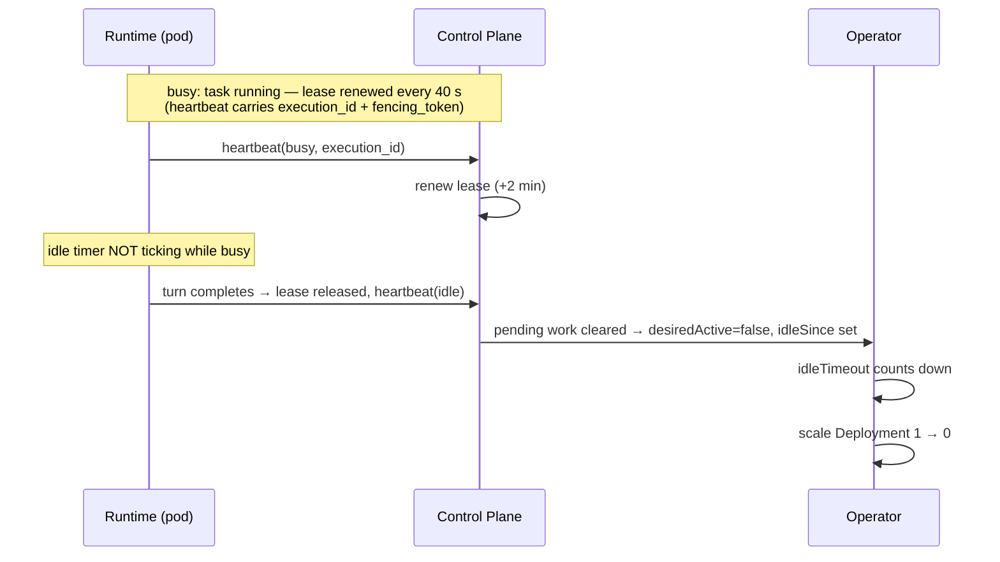

# skquad — Kanban Board & Task Lifecycle Design

> **Status:** Draft v1
>
> Each squad has a **Kanban board** — the **primary work surface** for the
> squad. **Tasks** are the unit of work. Agents **pick up tasks** assigned to
> them; their **working context resets before each new task**.
>
> Basic task assignment, claim, status, runtime context, execution leases, and
> fenced terminal updates are implemented. Remaining hardening is tracked in
> [`implementation-status.md`](implementation-status.md).

---

## 1. Board

- **One board per squad** (1:1).
- The board is the **primary way a user interacts with the squad**: create /
  assign tasks, watch progress.
- Columns (states):

| Column | Meaning |
|--------|---------|
| `backlog` | Not ready to start / not yet prioritized. **Never claimable by agents** (S-213, S-228): invisible to every agent pickup/listing path until a human moves it out. |
| `todo` | TO DO — **ready to start, prioritized by the squad owner**. The only column agents pick up from. |
| `in-progress` | An agent is actively working on it. |
| `in-review` | Work done, awaiting review (by an agent or user). |
| `done` | Complete. |
| `blocked` | Cannot proceed (dependency, missing access, error). |

**Pickup rule (S-228):** agents may only claim/start tasks in `todo`
(or resume their own `in-progress` task after a crash). Claiming or
starting anything else — `backlog` included — is rejected server-side
with a machine-readable 409 (`task_in_backlog` / `task_not_claimable`).

- The board is **owned by the squad** and isolated in the squad namespace.
- Users with access (owner + granted users) can view and manage the board.

---

## 2. Task Model

```
task(
  id,
  board_id,          # the squad's board
  title,
  description,       # what to do, acceptance criteria, context
  status,            # todo | in-progress | in-review | done | blocked
  assignee_agent_id, # the agent working on it (nullable)
  created_by,        # user id OR agent id (polymorphic)
  position,          # ordering within a column
  metadata,          # JSON (labels, links, attachments, etc.)
  created_at,
  updated_at
)
```

- **`created_by` is polymorphic** — a task can be created by a **user** (on
  their squad's board) or by an **agent** (including on **another squad's
  board**, if permitted — see cross-squad handoff).
- A task has **one assignee agent** at a time.

---

## 3. Task Lifecycle

```mermaid
stateDiagram-v2
    [*] --> backlog: created unprioritized
    [*] --> todo: created ready
    backlog --> todo: human prioritizes (the instruction to start)
    todo --> in-progress: assigned + agent picks up (context reset)
    in-progress --> in-review: agent marks ready
    in-progress --> blocked: agent/user flags blocker
    in-review --> done: approved
    in-review --> in-progress: changes requested
    blocked --> todo: unblocked
    blocked --> in-progress: unblocked + picked up
    done --> [*]
```

- **Create (`todo`):** a user (or agent) creates the task on a board.
- **Assign:** a user (or agent, via delegation) assigns the task to an agent.
- **Pick up (`in-progress`):** the agent's **working context is reset**, the
  operator **scales the agent 0 → 1**, and the agent starts the task.
- **In review:** the agent marks the task ready; a reviewer (agent or user)
  checks it.
- **Done:** approved → `done`.
- **Blocked:** flagged when it cannot proceed; returns to `todo` or
  `in-progress` when unblocked.

---

## 4. Task Creation & Assignment

### 4.1 By a user
- A user creates a task on **their squad's board** (or a board they have access
  to).
- The user **assigns** it to an agent in the squad.
- Assigning a task to an agent **signals the operator** to scale that agent up
  (if it is at 0).

### 4.2 By an agent
- An agent can **create a task** — typically as part of **delegation** or
  **cross-squad handoff** (see [collaboration-messaging.md](collaboration-messaging.md)).
- An agent can create a task on **its own squad's board** or on **another
  squad's board** (if an access grant permits it).
- Agent-created tasks are **audited** (actor = agent).

---

## 5. Agent Pickup & Context Reset

When an agent picks up a task:

1. The **operator** scales the agent's Deployment **0 → 1** (if idle).
2. The agent runtime **resets its working context** (clears the previous task's
   conversation/scratch state).
3. The runtime **loads the task** (title, description, metadata).
4. (Optionally) the runtime **retrieves relevant long-term memory** into the
   fresh context.
5. The agent **runs the core loop** for the task (see
   [agent-runtime.md](agent-runtime.md)).
6. On completion, the agent submits the execution ID and fencing token with
   its terminal status/result summary. The control plane stores the result on
   the execution attempt in the same transaction as the task status update,
   then optionally attempts to store a bounded memory summary. Memory write
   failure is audited but does not make the completed task look retryable.

> **Key invariant:** an agent works on **one task at a time**. Its working
> context is scoped to the current task and reset before the next. Incoming
> messages while working are **queued** (not delivered) to protect the context.

---

## 6. Interaction Model

- **Primary:** the user interacts with the squad **through the board** — create
  tasks, assign them, watch columns move, review results.
- **Secondary:** the user can **chat directly** with an agent (a 1:1
  conversation) for ad-hoc questions or steering. Chat is **not** a task; it
  does not reset the task context (it is a separate, lightweight interaction).
- The board gives the user **visibility** into what each agent is doing and the
  squad's overall progress.

---

## 7. Relationship to Other Components

- **Control plane** — mirrors assigned `todo`/`in-progress` task state into the
  Agent CR so `desiredActive` wakes or keeps the assignee warm.
- **Operator** — scales the assignee Deployment up from `desiredActive`, records
  `idleSince` when the control plane clears pending work, and scales back to
  zero after the agent's idle timeout elapses.
- **Agent runtime** — picks up the task, resets context, runs the loop, updates
  status.
- **Message queue** — delegation / cross-squad handoff create tasks + pings
  (see [collaboration-messaging.md](collaboration-messaging.md)).
- **Identity & AuthZ** — enforces who can create/assign tasks on a board
  (owner + granted users; agents per access grants).
- **Postgres** — stores boards + tasks.
- **Web app** — board UI (columns, cards, drag/assign, detail view).

---

## 8. Concurrency & Consistency

- **One assignee at a time** — a task has a single `assignee_agent_id`.
- **Column moves** are atomic (single write) to avoid races.
- **Pickup is lease-backed** — claim creates a `task_execution` attempt with a
  worker ID, lease expiry, and fencing token. A second runtime cannot claim
  while the active lease is valid.
- **Crash recovery is lease-based** — if an agent pod dies mid-task, another
  runtime can reclaim the assigned `in-progress` task only after the previous
  execution lease expires.
- **Terminal updates are fenced** — complete/block requests must include the
  active execution ID and fencing token. Stale tokens are rejected with
  conflict and cannot overwrite the task result.
- **Optimistic concurrency** on task updates (version/updated_at check) to
  prevent lost updates when a user and agent both act remains a follow-up for
  user-driven board edits.

---

## 9. Execution Lease vs Scale-to-Zero Idle Timeout

The **task-execution lease** (§8) and the **scale-to-zero idle timeout**
(ADR-0003) are two *independent timers* that protect different failure
domains but share the same heartbeat stream. They never gate each other
directly.

| | Task-execution **lease** | **Scale-to-zero** idle timeout |
|---|---|---|
| Scope | Per **task attempt** (`task_executions`) | Per **agent pod** (Deployment replicas) |
| Duration | 2 min (`defaultTaskExecutionLease`), renewed every **40 s** (`SKQUAD_HEARTBEAT_INTERVAL_SECONDS`) by the runtime's lease-heartbeat thread with `execution_id` + `fencing_token` | `spec.idleTimeout` on the Agent CR (configurable per agent; minutes-scale) |
| Owner | Control plane — the **execution reaper** (30 s sweep, 2-min grace) expires lapsed executions and re-queues the task ≈ **4 min** after the last heartbeat | Operator — tracks `status.idleSince` and scales the Deployment to 0 when `now − idleSince ≥ idleTimeout` |
| Protects against | Worker **dying while holding work**: task stuck `in-progress` forever; zombie worker reporting on a stale attempt (fencing) | **Paying for idle pods** |

### Lifecycle interaction



### Coupling points (code-level)

1. **A running task can never be scaled to zero mid-turn.** Busy heartbeats
   carry the execution id and keep the agent non-idle; the operator only
   counts `idleSince` when the agent is not `DesiredActive`/busy.
2. **Anti-race on the way out:** `resolveHeartbeatStatus` (control plane)
   *upgrades* an idle heartbeat to busy if new pending work arrived — a pod
   cannot scale down in the gap between finishing task A and picking up
   task B.
3. **The lease does not keep the pod alive, and the idle timeout does not
   protect the task.** If the pod dies mid-task: the lease lapses → the
   reaper re-queues the task (~4 min) → a future pod picks it up. The
   idle timer is irrelevant in that path.
4. **Budget enforcement (S-203 WP3) exploits this:** for a budget-blocked
   owner the operator applies `idleTimeout=0` on the Agent CR, so the pod
   tears down **immediately at end of turn** (no idle window), and the
   wake guard refuses to reschedule until the budget is raised. Blocked
   agents are never killed mid-turn.

> **Rule of thumb:** the **lease** answers *"is the worker alive?"* —
> failure detection, seconds-to-minutes. The **idle timeout** answers
> *"is the pod worth keeping?"* — cost policy, minutes. Both are fed by
> the heartbeat stream, but they are orthogonal: expiry of one never
> triggers or blocks the other.

See [execution-reaper.md](execution-reaper.md) for the reaper design and
[ADR-0003](adr/0003-scale-to-zero.md) for the scale-to-zero decision.

---

## 10. Budget Enforcement (S-203)

Cost Management enforces a per-user monthly budget (own budget row → else
platform default → else unlimited) and an optional platform-wide monthly
limit. Enforcement is **stop-at-end-of-turn**, never mid-turn kill — it
rides the scale-to-zero machinery of §9 rather than fighting it.

### Evaluation points

- **After every metered LLM call** (`ingestGatewayMetering`): the squad
  owner's month-to-date (MTD) spend is compared against their effective
  budget, and the platform-wide MTD against the platform limit.
- **After any budget mutation** (admin PUTs): affected users are
  re-evaluated so raising/resetting a budget resumes scheduling with no
  manual step. `sweepBudgets` is the general reconciliation hook.

### Thresholds & notifications (exactly-once)

Warnings fire at **80%** and **90%**; **100%** additionally blocks.
Each threshold claims an atomic `budget_notify_markers` row keyed by
(user, calendar-month, source+threshold): the winner writes **both**
the inbox message (`budget_warning`/`budget_stopped`) **and** the bell
notification (`NotificationBudgetWarning`/`NotificationBudgetStopped`,
S-203 WP4) — so exactly-once per threshold per month holds across all
channels, even under concurrent turns. Bell delivery honors the S-199
mute preferences (fail-open); the bell deep-links to `/costs`.

### Block & resume semantics

| Transition | What happens |
|---|---|
| **Block** (spend > 0 and ≥ budget) | `budget_blocks` row per user/month; every **start** path refuses with `budget_blocked` (wake endpoint, message/task-driven busy transitions, heartbeat idle→busy upgrade); CRs are re-mirrored with `idleTimeout=0` (§9 coupling pt. 4) so idle-warm pods scale to zero immediately and busy pods die at end of turn. |
| **Resume** (budget raised/reset, platform limit cleared) | Block row clears for the period; agents are re-mirrored with the normal idle timeout; scheduling resumes automatically. |

A zero budget blocks on the first recorded cost; zero spend never
blocks. Platform-limit blocks are tagged by source so clearing the
limit resumes exactly the users it blocked (`ClearBudgetBlocksBySource`).

**Mid-turn safety:** a block never kills a running pod. The in-flight
turn finishes, the agent goes idle, the mirror writes
`desiredActive=false` with the zeroed idle timeout, and the operator
tears the pod down immediately (§9 rule: the idle timeout is cost
policy — budget enforcement makes that policy absolute).

Code: `control-plane/internal/httpapi/budget_guard.go` (evaluation,
verdicts, notifications), `budget_blocks`/`budget_notify_markers`
(migrations 0037/0036), outbox CR mirror blocked-idle-timeout override,
wake guard `agentBudgetBlocked`.

---

## 11. Open Points

- **Subtasks** — whether tasks can have subtasks (start flat; add later).
- **Task templates** — reusable task definitions (later).
- **WIP limits** — per-column work-in-progress limits (later).
- **Task history** — full column-move history for audit/analysis (the audit log
  covers significant moves; a dedicated history table is optional).
