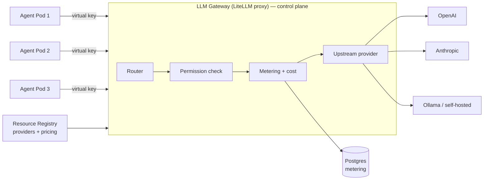

# skquad — Central LLM Gateway Design

> **Status:** Draft v1 · **Decision:** [ADR-0002](adr/0002-llm-gateway.md)
>
> The LLM gateway is the **single, model-agnostic endpoint** that **all agent
> LLM calls** flow through. It is intended to be the enforcement point for
> **metering, cost, BYOM routing, and agent permissions**. It is implemented
> with the **LiteLLM proxy**.
>
> The LiteLLM proxy, virtual-key provisioning, the metering callback path, and
> key lifecycle enforcement (update/revoke on permission change, drift
> reconciliation) are implemented. Full budget hardening remains follow-up
> work; see [`implementation-status.md`](implementation-status.md).

---

## 1. Why a Central Gateway

If every agent called LLM providers directly, we would:

- Duplicate **metering** logic in every agent.
- Scatter **credential** handling across agents.
- Make agent code **model-specific** (breaking BYOM).

A central gateway solves all three in one place: agents call **one endpoint**
with **one virtual key**, and the gateway handles routing, metering, cost, and
permissions.

---

## 2. Responsibilities

| Responsibility | Detail |
|----------------|--------|
| **Model-agnostic routing** | Agents request a *model*; the gateway routes to the correct upstream provider (OpenAI, Anthropic, Ollama, …). |
| **BYOM** | Routes to the right provider with the right credentials (from the registry / secrets). Users can bring their own provider + key. |
| **Metering** | Counts **input + output tokens** per call and attributes them to the **agent** and **squad**. |
| **Cost** | Computes **monetary cost** when the provider has **per-token pricing** configured. |
| **Permission enforcement** | An agent can only use **providers/models it is permitted** to use (checked against the agent's permission set). |
| **Virtual keys** | Issues a **virtual key per agent** so calls are attributable, rate-limitable, and budgetable. |
| **Rate limiting / budgets** | Per-agent (and per-squad) rate limits and optional spend budgets. |

---

## 3. Architecture



- The gateway runs as a **highly-available Deployment** in the control plane
  (`skquad-system`).
- It is **stateless** — all state (metering, keys, budgets) lives in Postgres.
- It reads **provider definitions** (base URL, models, pricing) from the
  **resource registry** and **credentials** from secrets.
- **S-155:** provider API keys are pasted into Settings → LLM providers
  and stored by the control-plane as Kubernetes Secrets named
  `skquad-provider-key-<provider-id>` (label
  `app.kubernetes.io/managed-by: skquad-control-plane`). The registry
  keeps only the `k8s://` ref plus a display mask (last 5 chars); API
  responses never include the key. The control-plane Role grants
  `secrets` get/create/update/patch/delete in its own namespace. A
  startup migration wraps any pre-existing literal keys automatically.

---

## 4. Virtual Keys

- Each **agent** is issued a **virtual key** by the gateway (via the control
  plane) when the agent identity is created or rotated and the LiteLLM admin
  URL/master key are configured.
- The agent uses **only its virtual key** to call the gateway — it never holds
  upstream provider credentials.
- The virtual key encodes the **agent identity** (and squad), so every call is
  attributable for metering, permissions, and rate limiting.
- Keys can be **rotated** and **revoked** (e.g. when an agent is deleted or its
  permissions change).

Current implementation note: the control plane calls LiteLLM `/key/generate`
with the model aliases from the agent's active `llm_provider` grants, writes
the returned raw key into the generated Kubernetes Secret, and stores the
Secret ref plus the returned key **token** (LiteLLM's hash of the key, never
the raw key) on the agent identity as `gateway_key_token` /
`gateway_key_status`. If LiteLLM admin settings are absent, local development
falls back to a generated opaque token.

### Key lifecycle enforcement (implemented)

- **Permission change (`PUT /agents/{id}/permissions`)**: the gateway key is
  synced **before** the permission commit. Models added → `/key/update` with
  the new allow-list; last LLM grant removed → `/key/delete` (revoked).
  A gateway failure aborts the permission change (502) so a revoked grant
  never keeps a live key.
- **Re-grant after revocation**: a fresh key is provisioned against the
  existing identity and written to the agent's virtual-key Secret.
- **Agent/squad deletion**: active keys are revoked at the gateway before the
  rows are deleted, so no untracked key survives.
- **Provider deprecation**: all agents granted the deprecated provider are
  re-converged (update, or revoke if no active models remain).
- **Drift reconciliation**: `POST /api/v1/admin/gateway/keys/reconcile`
  (platform admin) re-converges every agent's key against current grants
  and is idempotent; use it after partial failures. The identity-record
  write after a commit failure is audited as
  `*.gateway_key_record_stale` for exactly this repair path.
- **Model-deployment registration (S-GWREG)**: `POST /api/v1/ai-models`
  now provisions the gateway deployment (`/model/new`) **before** writing
  the registry row — see §4a below. `POST /api/v1/admin/gateway/models/reconcile`
  (platform admin) repairs drift between ACTIVE `ai_models` rows and the
  gateway's deployment list.
- **Runtime behavior on revoked keys**: LiteLLM rejects calls with revoked
  keys (auth error), which fails the task — fail-closed by design.

---

## 4a. Model-deployment registration (S-GWREG)

Registering an AI Model in the Settings UI fully provisions the gateway;
LiteLLM stays invisible to users. The control plane owns the gateway's
`model_list` (persisted via `store_model_in_db=true`; the ConfigMap
`model_list` is intentionally empty).

**Create (`POST /api/v1/ai-models`)** — fail-loud ordering:

1. Validate pricing/fields, provider existence, duplicate name.
2. Resolve the provider's kind → LiteLLM model prefix (`openai`,
   `anthropic`, `gemini`, `ollama_chat`, `ollama`, `azure` — identity
   mapping; unknown kinds are rejected) and its live API key (S-155
   Secret store; never logged).
3. `POST /model/new` with
   `{"model_name": "<ai_models.model_name>", "litellm_params": {"model": "<prefix>/<model_name>", "api_base": "<provider.base_url>", "api_key": "<resolved key>"}}`.
   A gateway failure returns **502 `gateway_provision_failed`** and **no
   registry row is written** — a model that exists in the UI but has no
   gateway deployment (the old "dead model" failure mode) cannot happen.
4. Write the `ai_models` registry row. If that fails, the just-created
   deployment is deleted again (compensate) and the gateway is reloaded.
5. Trigger a gateway rollout restart (§4b) so the router picks it up.

**Update (`PATCH /ai-models/{id}`)** — only when `provider_id` or
`model_name` changed (the routing identity):

- Same `model_name`, new provider/credentials → `/model/update` in place.
- Renamed → create the new deployment **first**, then delete the old one
  (no window without a deployment; no reliance on rename semantics).
  If the old deployment cannot be deleted, the new one is rolled back.
- Gateway failure → 502, the registry keeps its old working config.
- Display-only changes (display_name, pricing, context window) never
  touch the gateway.

**Dev mode**: when the gateway is not configured (no
`SKQUAD_LITELLM_ADMIN_URL`/master key), provisioning is skipped with a
warning log — existing dev/test flows keep working, but such models are
not routable.

**Reconcile (`POST /api/v1/admin/gateway/models/reconcile`, platform
admin)**: compares every ACTIVE `ai_models` row against the gateway's
`/model/info`. Missing models are registered (same shape as create);
gateway deployments with no active registry entry are reported as
`extras` **without being deleted** (deletion cascade is a follow-up).
Returns `{"registered": [...], "already_present": [...], "failed":
[{"model", "error"}], "extras": [{"model_name", "deployment_id"}]}` and
triggers exactly one rollout restart if anything was registered.
Audited as `gateway.models.reconcile`.

---

## 4b. Gateway rollout restart

The running litellm router does **not** pick up DB-persisted model
changes until the gateway pod restarts. The control plane now performs
this automatically after every successful model-deployment mutation:
a strategic-merge patch stamping the pod-template annotation
`skquad.io/gateway-reload: <timestamp>` on the gateway Deployment
(`SKQUAD_LLM_GATEWAY_DEPLOYMENT`, default `skquad-llm-gateway`, in the
control-plane namespace) — the same mechanism as `kubectl rollout
restart`. Required RBAC (`apps/deployments` get+patch) is part of the
api-server Role in the chart. Reload failures are logged loudly but do
not fail the originating request: the deployment is persisted and any
restart picks it up; re-running the model reconcile endpoint is the
repair path.

---

## 5. Metering & Cost

- For every completed call, the gateway records:
  - **agent id**, **squad id**, **model**, **provider**
  - **input tokens**, **output tokens**
  - **timestamp**
  - **cost** (if the provider has per-token pricing)
- **Cost calculation:** `cost = input_tokens × price_per_input_token +
  output_tokens × price_per_output_token` (prices from the provider's registry
  entry).
- Records are written to the **metering table** in Postgres (see
  [data-model.md](data-model.md)).
- The **web app** aggregates metering per agent and per squad (and shows cost
  where pricing is configured).
- Current implementation uses a LiteLLM custom callback
  (`skquad_litellm_callbacks.proxy_handler_instance`) loaded by the proxy. The
  runtime attaches agent, squad, and task metadata to every LiteLLM call; the
  callback posts successful usage to the control plane's internal
  `/api/v1/gateway/metering` endpoint. Gateway failures post an audit-only
  event. Callback delivery and audit writes are best-effort; the metering row
  is the durable success record.

```
POST /v1/chat/completions  (agent → gateway)
  → route to provider
  → on response: record {agent, squad, model, in_tokens, out_tokens, cost, ts}
  → return response to agent
```

---

## 6. BYOM Routing

- The **resource registry** holds **LLM provider** entries: `type`, `base_url`,
  `api_key_ref` (secret), `default_model`, `models`, `pricing`.
- The provider `id` is registry identity only. Agents send a concrete
  LiteLLM/gateway **model alias** such as `openai/gpt-4o-mini` or
  `ollama/llama3.2`.
- The gateway maps the requested model alias to its **provider** and routes the
  call to the provider's `base_url` using the provider's credentials.
- **Predefined providers** (admin-registered) power the fast onboarding path.
- **BYOM providers** (user-registered, with the user's key) are routed the same
  way — the agent just requests a model.

---

## 7. Permission Enforcement

- Before routing a call, the gateway checks the **agent's permission set**
  (from the control plane): is this agent permitted to use this **provider /
  model**?
- If not → **reject** the call (403) and log the attempt (audit).
- This means an agent can only spend on / use models its **squad owner** allowed.

---

## 8. API Surface (agent-facing)

The gateway exposes an **OpenAI-compatible** API (so LiteLLM and agent code stay
simple):

- `POST /v1/chat/completions`
- `POST /v1/completions`
- `GET /v1/models` (models the calling agent is permitted to use)

Control-plane management endpoints (for the API server, not agents):

- `POST /key/generate` (issue a virtual key for an agent)
- `POST /key/info`, `POST /key/update`, `POST /key/delete`
- `GET /global/spend`, `GET /spend` (metering queries)

Skquad uses `/key/generate` at identity create/rotate and on re-grant,
`/key/update` when a permission change alters the model allow-list, and
`/key/delete` on revocation, agent deletion, squad deletion, and full
provider deprecation. Budget enforcement remains follow-up work.

---

## 9. High Availability & Operations

- Run as a **Deployment** with ≥2 replicas; it is stateless.
- **Health checks** (`/health/liveliness`, `/health/readiness`).
- **Metrics** (Prometheus): requests, tokens, cost, latency, errors, per
  provider/model.
- **Alerts** on error rate, latency, and spend anomalies.
- **Backpressure / rate limiting** per virtual key to protect upstream providers.

---

## 10. Relationship to Other Components

- **Agent runtime** → calls the gateway (the only LLM path).
- **Resource registry** → provides provider definitions + pricing.
- **Identity & AuthZ** → provides the agent's permission set (for enforcement).
- **Postgres** → stores metering, keys, budgets.
- **Web app** → reads metering/cost for display.

---

## 11. Open Points

- **Caching** — semantic/exact caching of repeated calls to cut cost (later).
- **Fallbacks** — automatic failover to a secondary model on provider errors
  (later).
- **Budgets** — hard spend caps per agent/squad with automatic cutoff (later).
- **Streaming** — support streaming responses end-to-end (confirm in
  implementation).

## Fallback drill verification (2026-09-25, S-114)

A live drill was run against the production gateway to verify the ADR-0010
primary→fallback behaviour end-to-end. A throwaway squad + agent (owner =
break-glass) was bound to primary `halogen-qwen3.8-flash-next` with a synthetic
`drill-fallback-model` (an in-cluster OpenAI-compatible stub) as fallback. The
virtual key was provisioned with `models=[primary, fallback]` and
`router_settings.fallbacks=[{primary:[fallback]}]`.

Results:

| Scenario | Primary state | Reply arrives? | `metering.model_used` | Verdict |
| --- | --- | --- | --- | --- |
| Failover | primary unreachable (dead endpoint) | yes | `drill-fallback-model` | PASS — fallback served + metered |
| 400-class | primary returns HTTP 400 | **yes** | `drill-fallback-model` | **fallback STILL fires** (see below) |
| Restore | primary back on real endpoint | yes | `halogen-qwen3.8-flash-next` | PASS — primary used again |

**400-class caveat (confirms ADR-0010 L1).** The brief expected a 400 bad-request
to *not* trigger failover. It does. LiteLLM's generic `fallbacks` fire on every
exception class; `BadRequestErrorRetries=0` only suppresses the *retry* of the
primary, not the fallback attempt. This is the documented, accepted gap in
ADR-0010 L1 ("do not claim D7 is fully enforced"). A 400 from the primary is
therefore served once by the fallback. If a future LiteLLM release adds
per-class fallback exclusion, this can be tightened.

**Operational note — gateway model-list reload is automated (S-GWREG).**
`/model/new` and `/model/update` persist to the gateway DB but the running
router does **not** pick up the change until the gateway pod restarts. The
control plane now triggers that restart itself (see §4b) after every model
deployment change, so manual `kubectl rollout restart` is no longer required
for UI-registered models. Manual restart remains the fallback if the
control plane's reloader is unavailable (logged loudly in that case).
